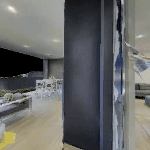
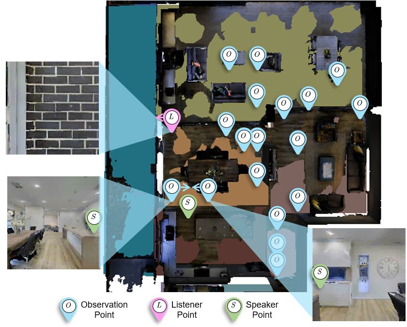
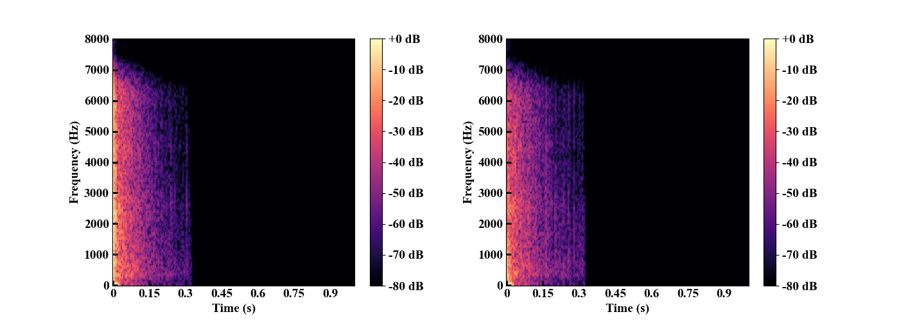
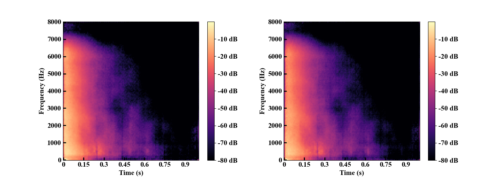
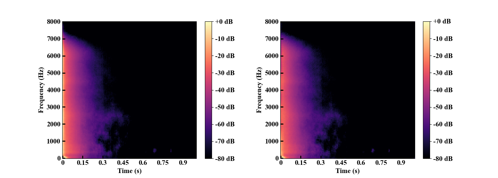
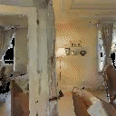
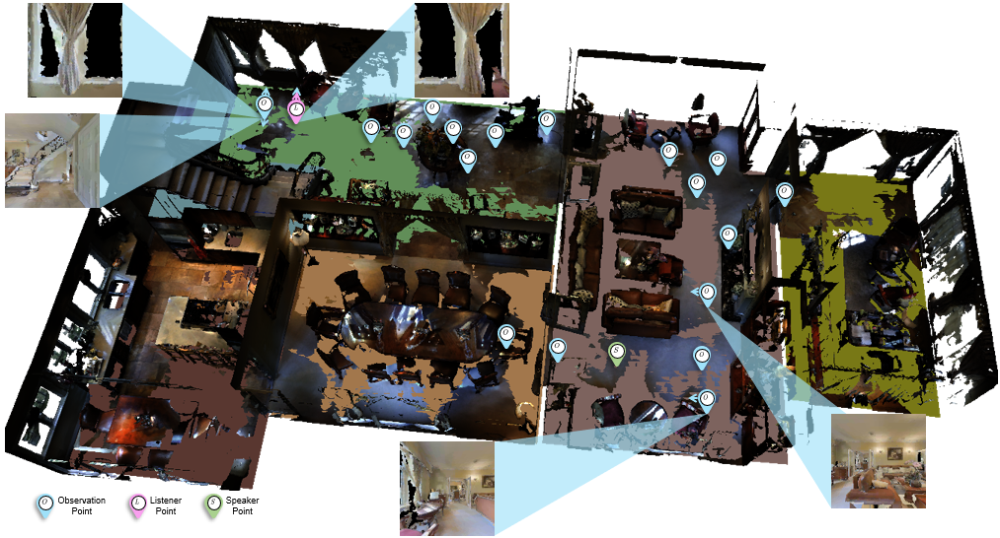
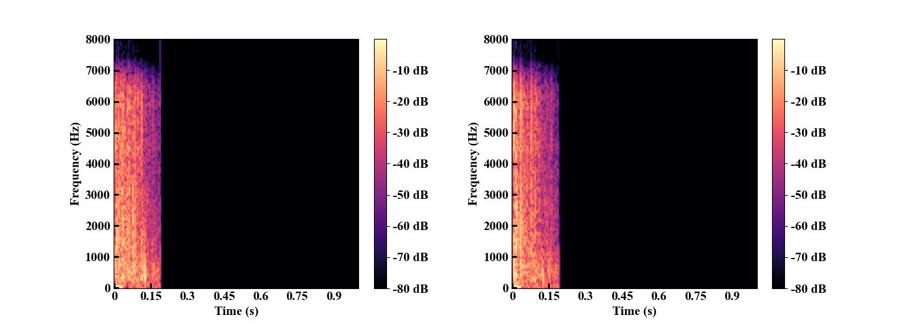
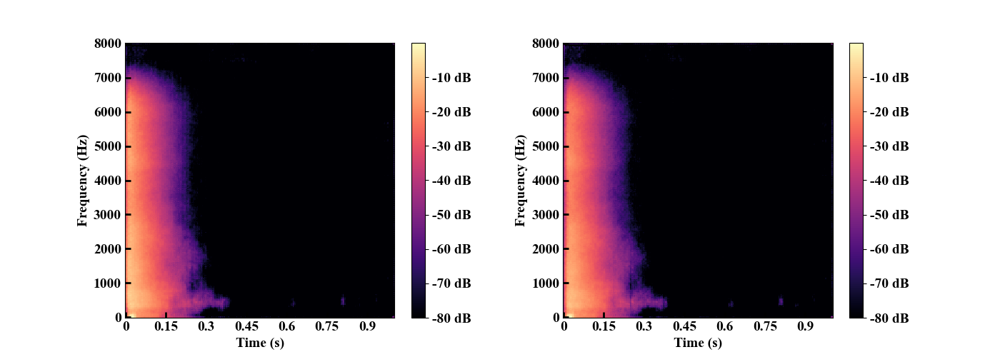

# Map-Guided Few-Shot Audio-Visual Acoustics Modeling

## demo
We visualize the results of eval and provide the corresponding audio files as follows.

### The given observations and query location
We provide a house tour gif to help understand the 3D scene and a top-down map indicate the locations of given few-shot observations and the query.

  

  

Blue pinpoints indicate the provided viewpoints. The blue arrow represents the direction of the provided viewpoints. The green pinpoint indicates the speaker that emits the audio in the query and the pink pinpoint indicates the listener that receives the audio. 

### The grouth truth audio

  <audio controls>
  <source src="audios/gt.wav" type="audio/wav">
  Your browser does not support the audio element.
  </audio>

  

### Few-ShotRIR predicted audio

  <audio controls>
  <source src="audios/baseline.wav" type="audio/wav">
  Your browser does not support the audio element.
  </audio>

  

### ours predicted audio

  <audio controls>
  <source src="audios/ours.wav" type="audio/wav">
  Your browser does not support the audio element.
  </audio>

  

## demo 2
We visualize the results of eval and provide the corresponding audio files as follows.

### The given observations and query location
We provide a house tour gif to help understand the 3D scene and a top-down map indicate the locations of given few-shot observations and the query.

  

  

Blue pinpoints indicate the provided viewpoints. The blue arrow represents the direction of the provided viewpoints. The green pinpoint indicates the speaker that emits the audio in the query and the pink pinpoint indicates the listener that receives the audio. 

### The grouth truth audio

  <audio controls>
  <source src="audios/gt-2.wav" type="audio/wav">
  Your browser does not support the audio element.
  </audio>

  

### Few-ShotRIR predicted audio

  <audio controls>
  <source src="audios/baseline-2.wav" type="audio/wav">
  Your browser does not support the audio element.
  </audio>

  

### ours predicted audio

  <audio controls>
  <source src="audios/ours-2.wav" type="audio/wav">
  Your browser does not support the audio element.
  </audio>

  

